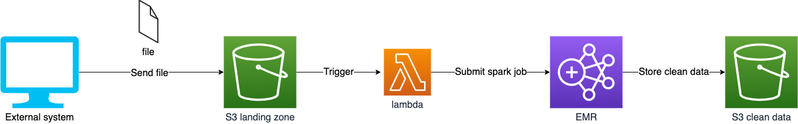
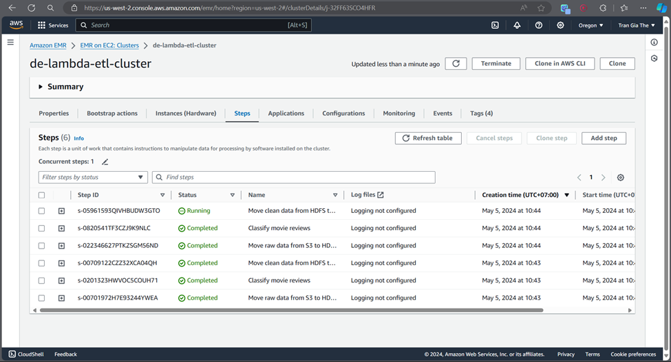
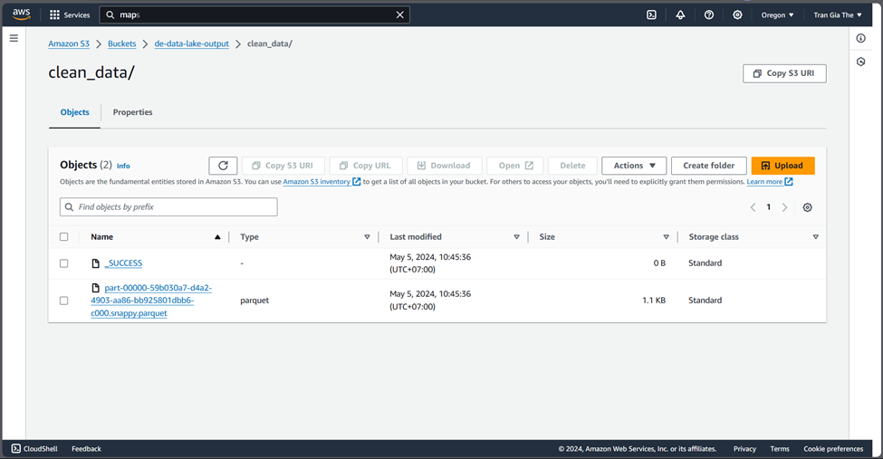
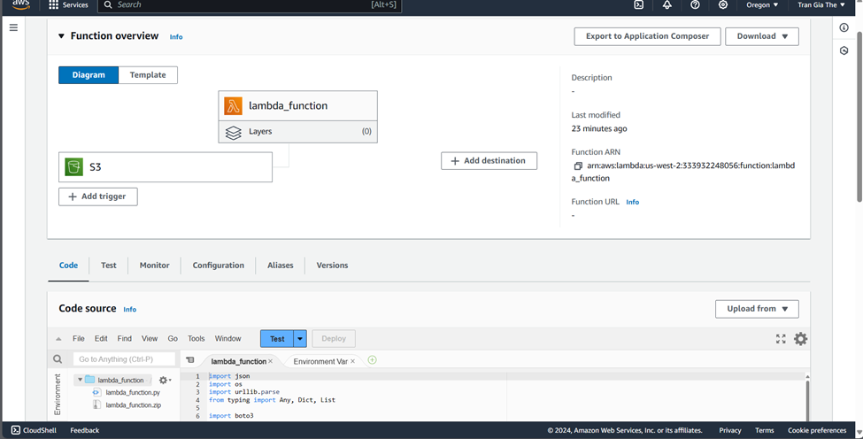
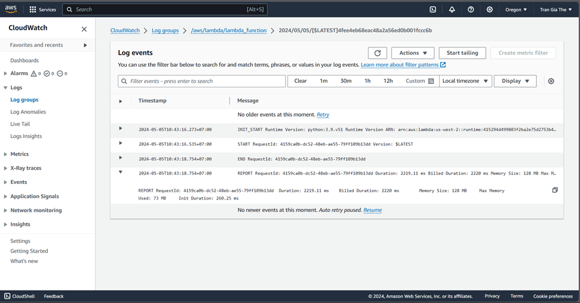

# Trigger Spark with Lambda on S3 Insertion using Terraform

This project sets up an AWS infrastructure using Terraform to trigger a Spark job with AWS Lambda when new data is inserted into an S3 bucket.


## Prerequisites

1. [AWS account](https://aws.amazon.com/)
2. [AWS CLI installed](https://docs.aws.amazon.com/cli/latest/userguide/cli-chap-install.html) and [configured](https://docs.aws.amazon.com/cli/latest/userguide/cli-configure-quickstart.html)
3. [git](https://git-scm.com/book/en/v2/Getting-Started-Installing-Git)

## Setup

Clone this repository to your local machine.

```bash
git clone <repository_url>
cd <repository_directory>
```

Initialize Terraform.

```bash
terraform init
```

Check the Terraform plan.

```bash
terraform plan
```

Apply the Terraform configuration.

```bash
terraform apply
```

This will set up the following resources:

1. An S3 bucket for data input.
2. An AWS Lambda function that is triggered when new data is inserted into the S3 bucket.
3. An EMR cluster with Spark installed.
4. IAM roles and policies for necessary access permissions.

The EMR cluster can take up to 10 minutes to start. In the meantime, we can trigger our lambda function by sending a sample data to our input bucket. This will cause the lambda function to add the jobs to our EMR cluster.

```bash
aws s3 cp data/review.csv s3://<you-bucket>/
```

## Monitoring and logging

In the AWS EMR UI, you can see that the steps are added to your EMR cluster. The steps are ordered in reverse in the UI.


Once the EMR cluster is ready, the steps will be run. You can check the output


Our lambda functions’ executions (and any print statements) will be logged in AWS CloudWatch. Go to the lambda UI and select monitor. You will be taken to the AWS CloudWatch logs page.



## Teardown

When you're done, you can destroy the resources created by Terraform.

```bash
terraform destroy
```
